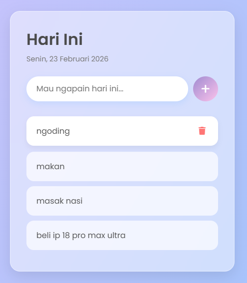

# 📝 To-Do List App

Aplikasi **To-Do List sederhana dan modern** berbasis **HTML, CSS, dan JavaScript**.  
Dirancang dengan tampilan **glassmorphism**, animasi halus, serta interaksi yang intuitif untuk membantu mencatat dan mengelola aktivitas harian.

---

## 🚀 Live Preview

> https://revanyangel.github.io/to-do-list/

  

---

## ✨ Fitur Utama

- ➕ Menambahkan to-do baru
- ✅ Menandai to-do sebagai selesai
- 🗑️ Menghapus to-do
- 📅 Menampilkan tanggal hari ini (Bahasa Indonesia)
- 🎨 Desain modern (glassmorphism & gradient)
- 📱 Responsive (mobile-friendly)
- ⚡ Animasi ringan dan smooth

---

## 🛠️ Teknologi yang Digunakan

- **HTML5** — struktur halaman
- **CSS3** — styling & animasi
- **JavaScript (Vanilla JS)** — logika aplikasi
- **Google Fonts (Poppins)**
- **Font Awesome** — ikon

---

## 🚀 Cara Menjalankan Project

1. **Clone repository** atau download file project
2. Pastikan ketiga file berikut berada dalam satu folder:
   - `index.html`
   - `style.css`
   - `script.js`
3. Buka file **`index.html`** di browser  
4. Aplikasi siap digunakan 🎉

---

## 📸 Preview Tampilan

- Header menampilkan **hari & tanggal**
- Input untuk menambahkan aktivitas
- Klik item → tandai selesai
- Hover item → tombol hapus muncul
- Saat kosong → pesan *empty state* ditampilkan

---

## 🧠 Cara Kerja Singkat

- Data to-do disimpan **sementara di DOM** (tidak menggunakan database / localStorage)
- Event utama:
  - Klik tombol `+` atau tekan `Enter` → tambah to-do
  - Klik item → toggle selesai
  - Klik ikon 🗑️ → hapus to-do dengan animasi